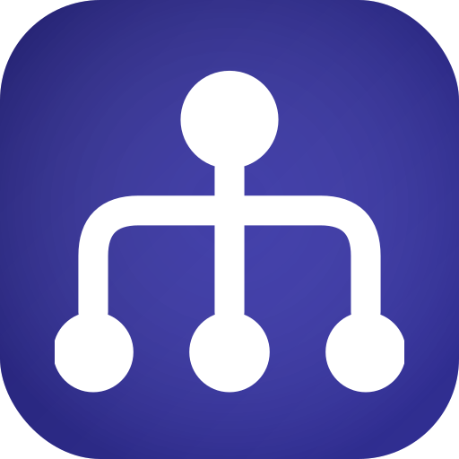
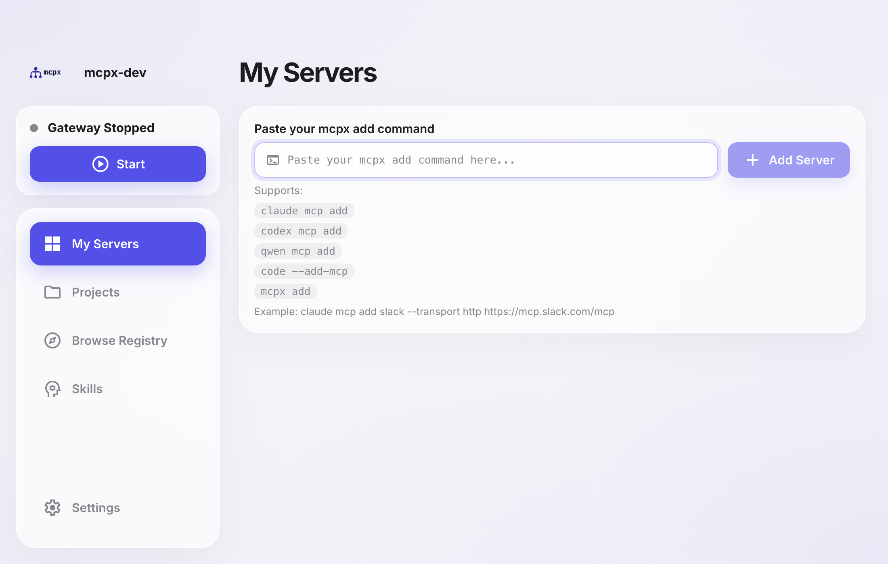
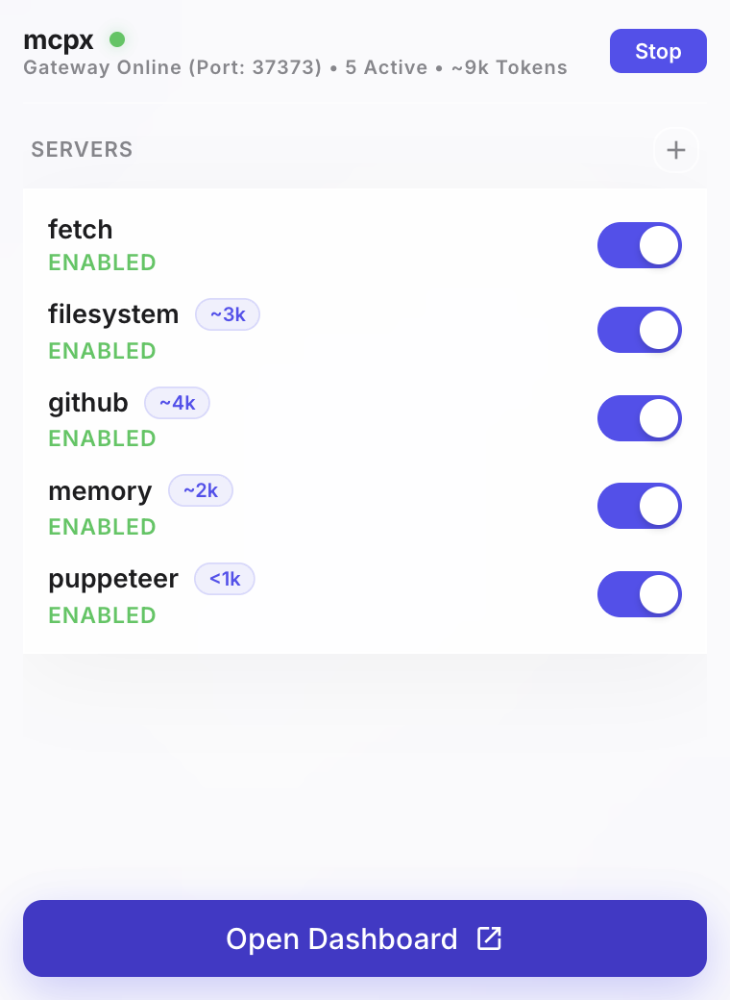
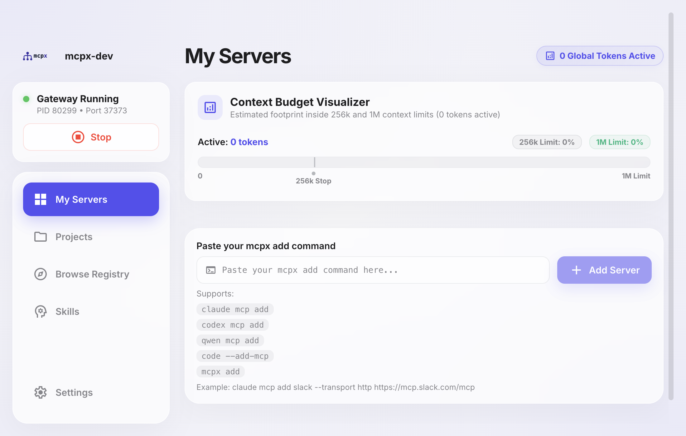
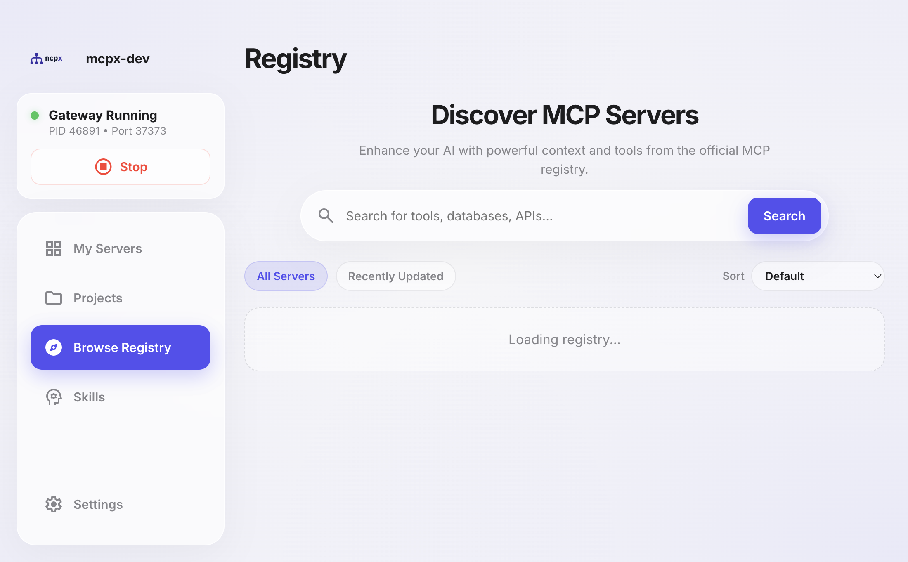
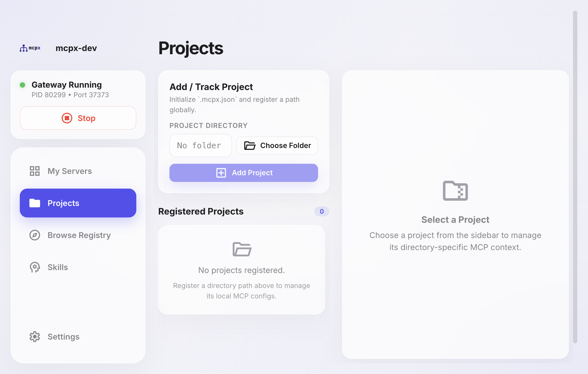
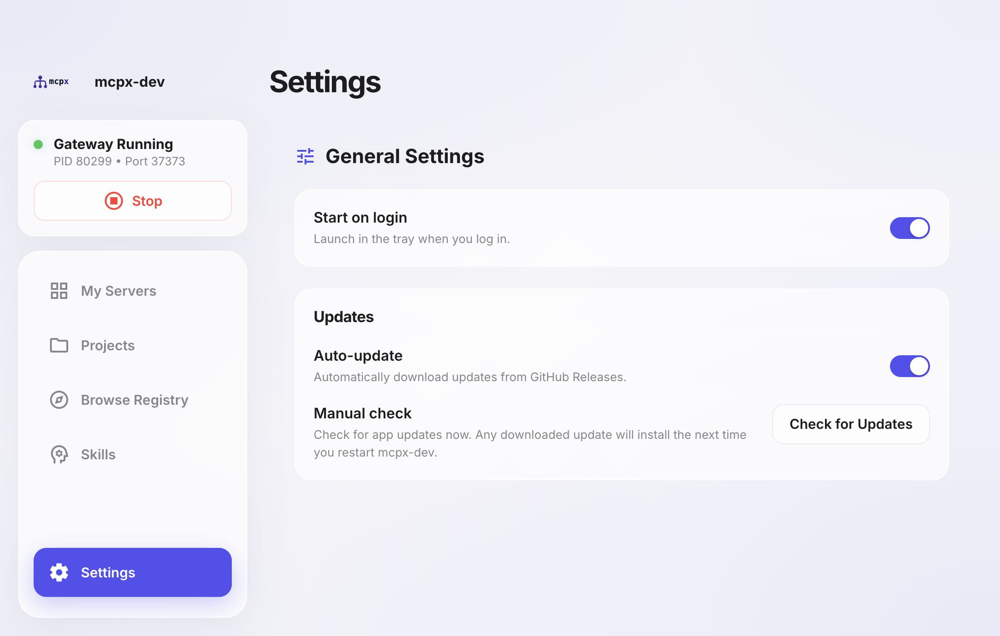

# mcpx

<p align="center">
  
</p>

<p align="center">
  <b>mcpx</b> is a local MCP gateway. Install upstream MCP servers once, authorize them once, and expose them to multiple AI clients — all managed from a native desktop app (macOS + Linux + Windows) or CLI.
</p>



## Platforms

- **macOS** — Desktop app (menubar tray) + CLI
- **Linux** — Desktop app (system tray) + CLI
- **Windows** — Desktop app (system tray) + CLI
- **CLI only**: Any platform with Node.js/Bun

## Desktop App

The mcpx desktop app is the easiest way to manage your MCP servers. It runs in your system tray with a full dashboard for server discovery, configuration, and monitoring.

- **Menubar tray** — Gateway status, quick server list, and one-click dashboard access from the menu bar
- **Dashboard** — Start/stop the gateway daemon, view connected servers, and add new ones with a paste-and-go command input
- **Browse Registry** — Discover and one-click install servers from the official MCP Registry
- **Projects** — Organize servers into project-specific groups
- **Skills** — Create and manage shared MCP skill definitions
- **Settings** — Configure auto-start, launch-at-login, and auto-updates

### Download

Download the latest release from [GitHub Releases](https://github.com/kwonye/mcpx/releases).

### Install from source

Prerequisites: [Bun](https://bun.sh) >= 1.2

**macOS:**
```bash
git clone https://github.com/kwonye/mcpx.git
cd mcpx/app
bun install
bun run desktop-install
```

This builds and installs the app to `/Applications/mcpx.app`.

For development with DevTools:
```bash
bun run desktop-install:dev
```

**Linux:**
```bash
git clone https://github.com/kwonye/mcpx.git
cd mcpx/app
bun install
bun run build
bunx electron-builder build --linux
```

This produces an AppImage and `.deb` in `app/dist/`.

**Windows:**
```bash
git clone https://github.com/kwonye/mcpx.git
cd mcpx/app
bun install
bun run build
bunx electron-builder build --win
```

This produces an NSIS installer and portable `.exe` in `app/dist/`.

### Quick Tour

**Menubar tray & popover** — The tray icon shows gateway status (green = running, red = stopped). Click it to open a quick-status popover:



- **Start / Stop** the gateway daemon
- See active server count at a glance
- **Add Your First Server** — Paste any `mcpx add` command directly into the popover
- **Open Dashboard** — Jump to the full management window

**My Servers tab** — The main view for managing your MCP servers:



- See all configured upstream servers and their connection status
- Start/stop the gateway daemon
- Add servers by pasting an `mcpx add` command (e.g. `mcpx add vercel https://mcp.vercel.com/mcp`)

**Browse Registry tab** — Discover and install MCP servers from the official registry:



- Browse curated MCP servers
- One-click install

**Projects tab** — Organize servers into project groups:



**Skills tab** — Manage shared skill definitions:


**Settings tab** — App configuration:



---

## CLI

The `mcpx` CLI is also available as a standalone npm package for terminal workflows and CI.

### Install

```bash
npm install -g @kwonye/mcpx@latest
# or
bun add -g @kwonye/mcpx@latest
```

### Quick Start

#### Add servers with CLI (recommended)

```bash
mcpx add vercel https://mcp.vercel.com/mcp
mcpx add next-devtools npx next-devtools-mcp@latest
```

`mcpx add` and `mcpx remove` auto-sync by default. Run `mcpx sync` when you want a manual re-sync or to target specific clients.

#### Client-native compatibility shims

```bash
# Claude Code
mcpx claude mcp add vercel https://mcp.vercel.com/mcp

# Codex
mcpx codex mcp add next-devtools --env FOO=bar -- npx next-devtools-mcp@latest

# VS Code
mcpx code --add-mcp '{"name":"vercel","url":"https://mcp.vercel.com/mcp"}'
```

#### Add servers manually in JSON config

Edit `~/.config/mcpx/config.json` and add entries under `servers`:

```json
{
  "servers": {
    "vercel": {
      "transport": "http",
      "url": "https://mcp.vercel.com/mcp",
      "headers": {
        "Authorization": "secret://vercel_auth_header"
      }
    },
    "next-devtools": {
      "transport": "stdio",
      "command": "npx",
      "args": ["next-devtools-mcp@latest"],
      "env": { "FOO": "bar" },
      "cwd": "/path/to/project"
    }
  }
}
```

After manual edits, run `mcpx sync` to propagate changes.

---

## What it does

- Stores upstream servers in a central config (`~/.config/mcpx/config.json`)
- Stores upstream auth in one consolidated secure store (AES-256-GCM encrypted file) so each MCP auth flow is done once and reused across all synced clients
- Runs a local MCP gateway daemon (`http://127.0.0.1:<port>/mcp`)
- Syncs managed gateway entries into supported clients:
  - Claude / Claude Code
  - Codex
  - Cursor
  - Cline
  - OpenCode
  - Kiro
  - VS Code / VS Code Insiders
  - Qwen CLI
  - OpenClaw
  - Hermes
- Gives each upstream a top-level client entry (`/vercel`, `/next-devtools`, etc.) while routing through one local daemon
- Uses local gateway-token auth for client → gateway (`x-mcpx-local-token`)
- Supports encrypted-file backed secret references for upstream headers (AES-256-GCM, no Keychain)
- Passes upstream OAuth challenges through to compatible clients
- Proxies OAuth well-known metadata endpoints in single-upstream mode

---

## Advanced CLI Usage

### Auth and secrets

```bash
mcpx secret set vercel_auth_header --value "Bearer <token>"
mcpx secret ls
mcpx secret rm vercel_auth_header

mcpx auth set vercel --header Authorization --value "Bearer <token>"
mcpx add xquik https://xquik.com/mcp
mcpx auth set xquik --header Authorization --value "Bearer <XQUIK_API_KEY>"
mcpx auth set next-devtools --env NEXT_DEVTOOLS_TOKEN --value "<token>"
mcpx auth show
mcpx auth rm vercel --header Authorization --delete-secret
mcpx auth rotate-local-token
```

### Daemon lifecycle

```bash
mcpx daemon start
mcpx daemon status
mcpx daemon logs
mcpx daemon stop
```

### Targeted sync

```bash
mcpx sync
mcpx sync claude
mcpx sync --client claude --client codex
```

### Config/data/state path overrides

- `MCPX_CONFIG_HOME`
- `MCPX_DATA_HOME`
- `MCPX_STATE_HOME`

### Troubleshooting

```bash
mcpx doctor
mcpx status
mcpx daemon logs
mcpx sync --json
```

`mcpx status` opens an interactive MCP inventory menu in TTY sessions showing each configured upstream, which clients have it synced, and actions (configure auth, re-authenticate, clear auth, reconnect, disable).

---

## Build and test from source

### CLI

```bash
cd cli
bun install
bun run build
bun test
```

### Desktop app

```bash
cd app
bun install
bun run dev      # Start Electron dev server
bun run build     # Build for production
bun run test      # Run unit tests
bun run e2e       # Run Playwright E2E tests
```

---

## Architecture

This is a monorepo containing:

- **`cli/`** — The `mcpx` CLI and core library (`@kwonye/mcpx`)
- **`app/`** — The desktop app (Electron + React) for macOS, Linux, and Windows

The desktop app imports the CLI's core logic directly via a `@mcpx/core` TypeScript alias, so both packages share identical configuration parsing, sync logic, and secret management.

## Notes

- Client connectivity is HTTP-first; upstreams can be HTTP or stdio
- Secrets are stored in an encrypted file (`secrets.json` + `secrets.key` in the data directory) using AES-256-GCM via Node's built-in `crypto`. No native dependencies, no Keychain prompts.
- `MCPX_SECRET_<name>` env var overrides work on all platforms for CI/headless
